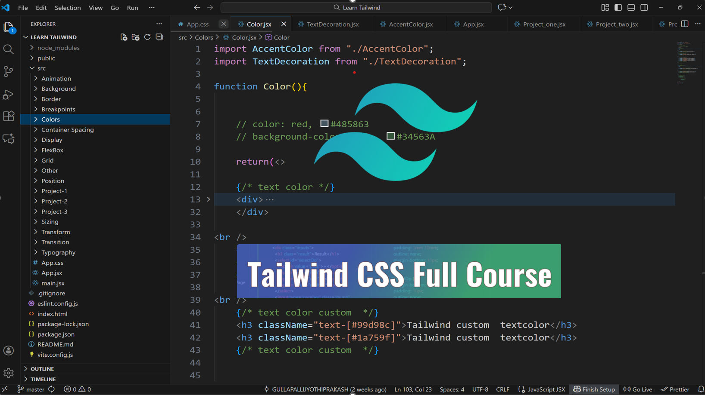

# 🎨 Tailwind CSS 2025 (v4) – Complete Learning Course

A fully organized **Tailwind CSS 2025 (version 4) learning repository** that covers every core concept of Tailwind.
This project includes **utility examples, responsive layouts, transforms, animations**, and mini UI projects — all created using **Tailwind v4, React**, and **Vite..**

## This repository serves as:

- A personal knowledge base
- A reference guide for utility classes
- A hands-on playground of experiments
- A set of beginner → advanced Tailwind examples
- A showcase of my understanding of responsive, utility-driven UI design 

---

## 📂 Repository Structure

The **src/** directory contains topic-wise folders, each with live examples and explanations.
| 📁 Folder | 📌 Description |
|-----------|----------------|
| 🎞️ Animation | Keyframes, transitions, motion utilities |
| 🌈 Background | Colors, gradients, images |
| ✏️ Border | Border, outline, ring utilities |
| 📱 Breakpoints | Responsive utilities (sm → 2xl) |
| 🎨 Colors | Color system & custom palette |
| 📦 Container Spacing | Margin, padding, gap, spacing |
| 🖥 Display | block, inline, flex, grid |
| 🧩 FlexBox | Layout, alignment, grow/shrink |
| 🧱 Grid | Grid layouts, templates |
| 📍 Position | relative, absolute, sticky, fixed |
| 🔄 Transform | rotate, scale, skew, translate |
| ⏱ Transition | animations and smooth interactions |
| ✒️ Typography | Fonts, spacing, decoration |
| 📐 Sizing | width, height, min/max |
---

## 📂 Tailwind Projects

The **src/** directory contains topic-wise folders, each with live examples and explanations.
| 📁 Folder | 📌 Description |
|------------|-----------------|
| 🚀 Project-1 | First project |
| 🚀 Project-2 | Second project |
| 🚀 Project-3 | Third project |
| 🚀 UserCard| User Profile Card Design |

---

## ⚡ Tech Stack
- **Frontend Framework:** React (with Vite)  
- **Styling:** Tailwind CSS V4  
- **Build Tool:** Vite  
- **Package Manager:** Node.js & npm  

---
## 🧠 Skills Demonstrated
- **Tailwind CSS (v4):** Mastery of utility-first styling.=
- **Responsive Layouts:** Flexbox, Grid, Breakpoints.
- **UI Design Understanding:** Spacing, hierarchy, modern layout patterns.
- **Animation & Interaction:** Smooth transitions, transforms, keyframes.
- **React Fundamentals:** Components, JSX structuring.
- **Structured Learning Approach:** Real examples for each utility.

## 📘 Why This Course Repository?
- **Deep Understanding:** Covers each Tailwind concept separately.
- **Realistic Practice:** Includes working mini-projects.
- **Fast Reference:** Each folder is a visual explanation of utilities.
- **Modern Skills:** Tailwind v4 is future-ready and industry-wide adopted.
- **Showcases Dedication:** A structured study approach demonstrating discipline and clarity.

